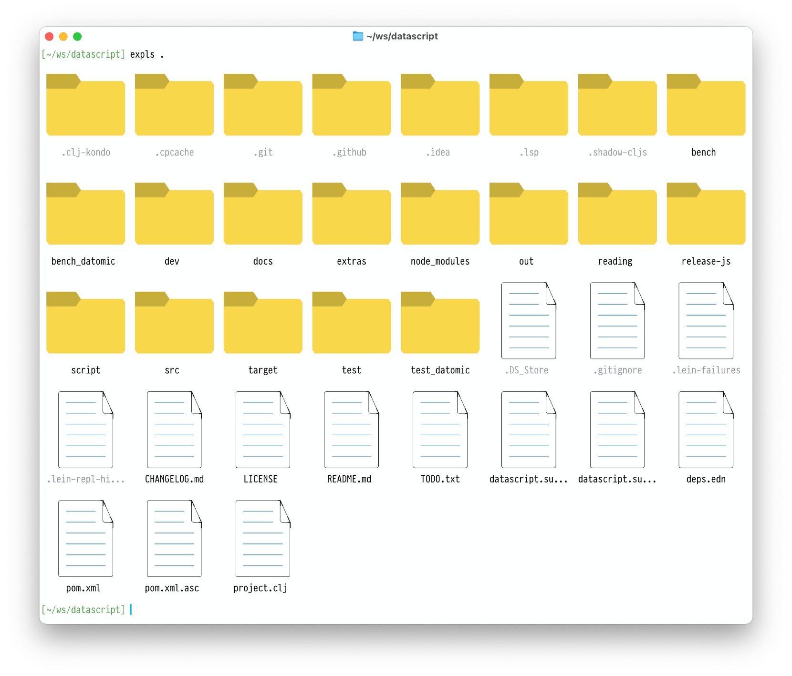

# Friendlier alternative to ls

Terminal looks scary? Fear not! This tool brings familiarity of File Explorer to your terminal.



# Prerequisites

- [Babashka](https://babashka.org/) or [Clojure](https://clojure.org/)
- [Pragmata Pro](https://fsd.it/shop/fonts/pragmatapro/)
- Terminal ([Ghostty](https://ghostty.org/) works great)

# How to use

```sh
alias expls='bb /path/to/expls.clj'
expls <dir>
```

